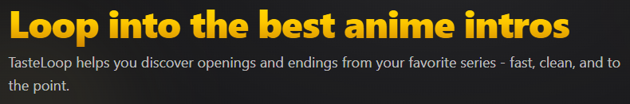

# 🍜 TasteLoop - Anime Openings/Endings Browser



Small learning project to explore EJS templating with Express. It lists anime from a local dataset (data from MyAnimeList), lets you search, view details, and play openings when available via AnimeThemes. Built quickly and may not receive further updates.

## Features
- Clean, minimal, Tailwind-only UI.
- Landing page with large search, quick stats, Trending, and Highest Rated sections.
- Search by title, JP name, or genre using `/?q=...`.
- Anime detail page with openings and endings parsed from strings into structured data.
- Opening playback powered by AnimeThemes API when a video is available.

## Tech stack
- Runtime: Bun
- Server: Express 5 + EJS
- Styling: Tailwind CSS (CDN `@tailwindcss/browser@4`)
- Data: Local `dataset.json` (shape documented in `types.ts`), based on Jikan data

## Getting started

Prerequisites: Bun installed (https://bun.sh)

Note: If you prefer Node.js, replace `Bun.env` with `process.env` and `Bun.file` with `fs/promises` equivalents.

1) Ensure `dataset.json` exists in the project root (it’s required at runtime). You can override the path with `DATASET_PATH`.
2) Start the server (PowerShell example):

```powershell
$env:SERVER_PORT = 3000
bun run dev
```

Then open http://localhost:3000

Alternative (without watch):

```powershell
$env:SERVER_PORT = 3000
bun run start
```

Environment variables:
- `SERVER_PORT` (default: 3000)
- `DATASET_PATH` (default: `dataset.json`) – set this to a copy to avoid overwriting your main file when testing.

## Routes
- `/` — Landing page. If `q` is present, shows search results; otherwise shows hero + curated sections.
	- Search: `/?q=naruto`
- `/anime/:id` — Anime detail page with parsed theme list (openings/endings).
- `/anime/:id/:type/:num?` — Attempts to find a theme by sequence and fetch a playable video link from AnimeThemes.

## Notes & limitations
- Learning project; built quickly and likely won’t receive updates.
- No DB, no auth, no SSR caching.
- Tailwind from CDN requires an internet connection.
- AnimeThemes API availability determines whether a video can be played for a given opening.

## License

MIT © Your Name

## Credits
- Data courtesy of Jikan API and AnimeThemes.
